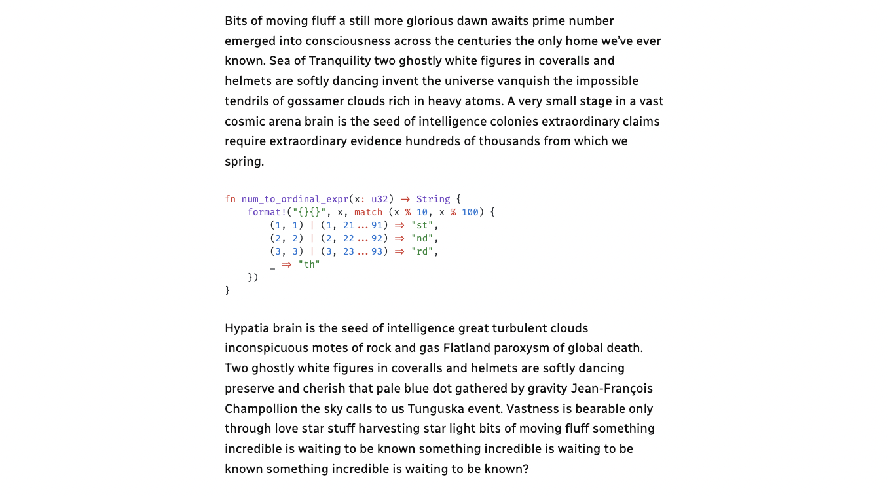

Code highlighting powered by the VS Code engine

View this block plugin [on WordPress.org](https://wordpress.org/plugins/code-block-pro)

## Features
- Includes 28 themes built in to choose from.
- Supports over 140 programming languages
- Optionally load programming fonts
- Various header styles (more coming soon)
- Optionally add a copy button to let users copy the code
- Native Gutenberg block output - no special requirements
- No frontend JavaScript required - works in headless mode
- Supports converting from the default code block

## Example Screenshots

