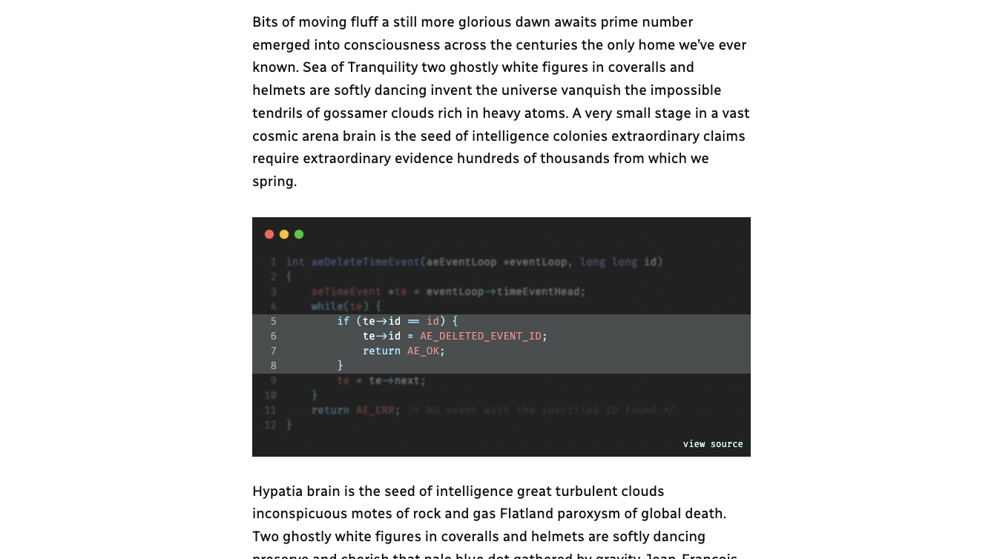

Code highlighting powered by the VS Code engine

View this block plugin [on WordPress.org](https://wordpress.org/plugins/code-block-pro)

## Features
- Includes 25+ built-in themes to choose from.
- Supports over 140 programming languages
- Optionally load programming fonts
- Line numbers
- Line highlighting
- Blur highlighting
- Header styles (more coming)
- Footer styles (more coming)
- Optionally add a copy button to let users copy the code
- Native Gutenberg block output - no special requirements
- Core functionality works in headless mode (see FAQ)
- Supports converting from the default code block

## Tips
- Try combining line highlighting with the blur effect to add some extra depth
- All settings are per block, but some settings are remembered when you add the next block.
- Add a link in the code footer (some footers support this, not all) that points to a https://codepen.io demo.

## Example Screenshots

